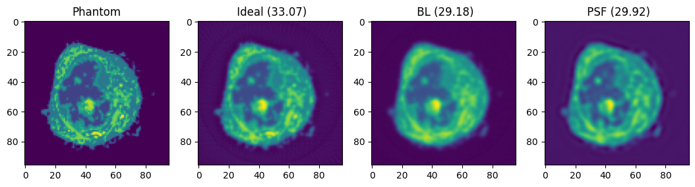

# ncxt_psftomo
Projection operators with PSF for x-ray tomography

[PSF correction in soft X-ray tomography](https://doi.org/10.1016/j.jsb.2018.06.003)
```
Ekman, A., Weinhardt, V., Chen, J. H., McDermott, G., Le Gros, M. A., & Larabell, C. (2018). PSF correction in soft X-ray tomography. 

Journal of structural biology, 204(1), 9-18.
```

Here is an example of a phantom, it's ideal reconstruciton and the reconstruction form bandwidth-limited projections using BL and PSF operators. 




See [example](PSF_projectors.ipynb) for example usage.

Install and test by running
```
pip3 install --upgrade ./
python -m unittest -v
```

